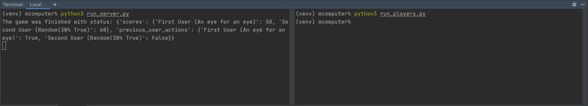

# Mind Wars

**[Video presentation](https://biteable.com/watch/what-we-do-explainer-copy-2687891)**

Are you a **programmer**, **data scientist**, or just an **enthusiast**?
Wide common tasks are boring for you and you want to get a real challenge? 
Create an algorithm that will achieve the best result and beat all your previous decisions. 
Or even invent your own game you want to play. All boring stuff is already implemented, 
all you need is to create 1 or 2 methods with Python, edit simple configurations, and launch.

This project created to help you launch your logic without boilerplate code. 
You will realize only pure logic. The result of your games will be saved, 
so you can create a nice visualization, 
or even analyze them to increase the performance of your AI.

For now, there is only 1 game - [Prisoners Dilemma](https://en.wikipedia.org/wiki/Prisoner%27s_dilemma) 
with 2 default AI strategies (Random or An Eye for an Eye - Retaliating and Random).
 
Feel free to realize your own. 
What you need to know - the system works with parallel games 
(you have a game state and players take an action simultaneously without knowing what is an opponent doing. 

This service can handle 1 and more users in the same game.

Some ideas for you:
1) Turn-based strategy
2) Worms
3) Tetris 
4) etc.


## Pre-requirements
1) Python3.6+

## Install

An installation will be shown for Unix system, 
but you can use Windows and Mac also (some steps will be different).

1) Download this code
2) Run `python3 -m venv venv`
3) Run `source venv/bin/activate`
4) Run `pip3 install -r requirements.txt`

Open 2 terminals and:
1) Run `python3 run_server.py` at first one. This will launch the server.
2) Run `python3 run_players.py` at second one. This will launch clients.

Be careful, the server will now closed up after game end. 
You can launch clients multiple time. All the results will be saved in `results` folder.


## Customizing
Add your custom player strategies to `custom_players` folder. 
Take a look to already realized one. This will help you.

To launch your custom player, edit `run_players.py`.

If you want to create a custom game, add your code to `custom_game_rooms`.
ake a look to already realized one.


An example of Player logic for Prisoners Dilemma.
```python
import random

from client.player import Player


class RandomStrategy(Player):

    def play(self, state: dict) -> dict:
        return dict(
            decision=random.uniform(0, 1) > 0.7  # will not cooperate in 70%
        )
``` 

# Usage example

